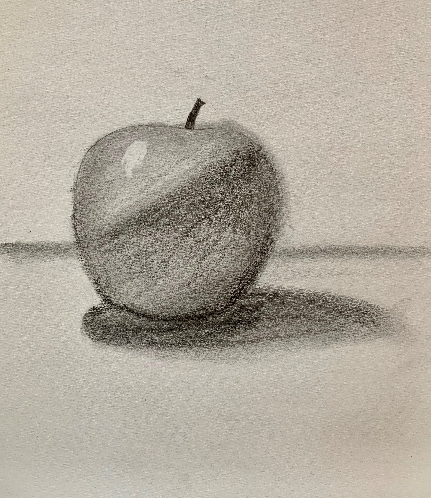

# My new file first heading

This is a para that I needed to add and check.

## A second level heading

Some more text added.

### A third level heading

|Heading 1|Heading 2|
|---------|---------|
|First row col 1| First row col 2|
|Second row col 1|Second row col 2|

## An image


Enter the `password`

```
My sample
code block
```

## A link and italics test

_You can read more about [Sketching](https://www.google.com/url?sa=t&rct=j&q=&esrc=s&source=web&cd=&cad=rja&uact=8&ved=2ahUKEwjRzvm_pMjtAhVSzjgGHUydCtYQmhMwHnoECCoQAg&url=https%3A%2F%2Fen.wikipedia.org%2Fwiki%2FSketch_(drawing)&usg=AOvVaw0gq5Lwc9S8zt0re8wv4wCK)._
